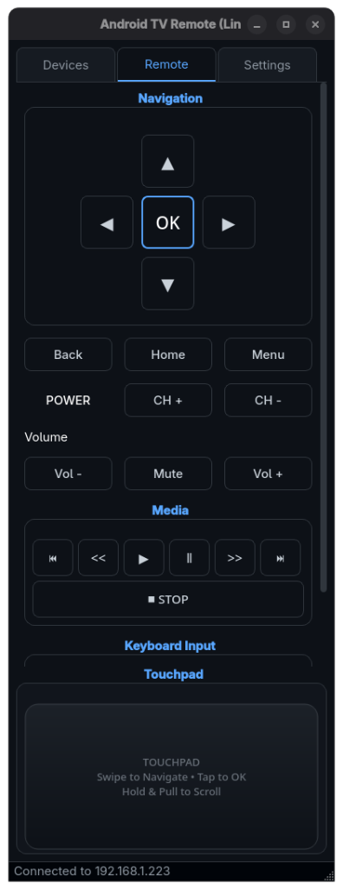
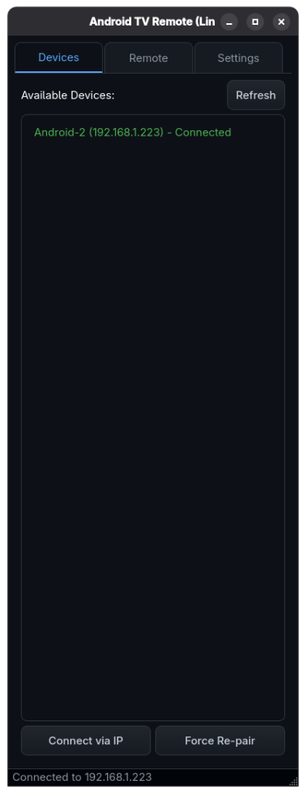
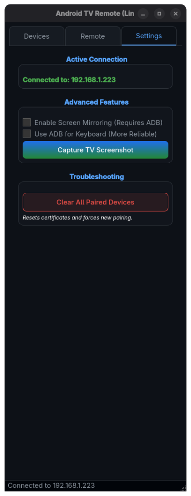

# Android TV Remote for Desktop

<div align="center">
  
</div>

<div align="center">
  <h3>A Premium, Touch-First Android TV Controller for Linux & Windows</h3>
  
  <p>
    <a href="#installation"><strong>Explore the docs »</strong></a>
    <br />
    <br />
    <a href="https://github.com/rexackermann/android-tv-remote/issues">Report Bug</a>
    ·
    <a href="https://github.com/rexackermann/android-tv-remote/issues">Request Feature</a>
  </p>
</div>

<div align="center">


</div>

---

## 📸 Gallery

<div align="center">
  
  
  
</div>

## ✨ Features

*   **🚀 Zero-Config Connection**: Automatically finds Android TVs on your Wi-Fi using standard Google protocols.
*   **🏎️ Physics-Based Touchpad**: A heavy, satisfying swipe experience with "Turbo" acceleration and kinetic inertia.
*   **📜 Kinetic Scrolling**: Flick through lists on your TV with the same smooth physics as your smartphone.
*   **⌨️ Real-Time Keyboard**: Type on your desktop keyboard and watch it appear instantly on the TV.
*   **🖥️ Screen Mirroring**: Integrated low-latency casting (via Scrcpy) for viewing your TV on your monitor.
*   **🌑 Premium Dark UI**: A modern, glass-morphic interface designed for OLED screens and late-night bingeing.

---

## 📥 Installation

### 🐧 Linux (System-Wide)

The recommended way for Fedora, Ubuntu, Arch, and other Linux distros.

1.  **Install System Dependencies**:
    *   **Fedora**: `sudo dnf install python3-devel android-tools scrcpy`
    *   **Ubuntu/Debian**: `sudo apt install python3-dev android-tools-adb scrcpy`
    *   **Arch**: `sudo pacman -S python android-tools scrcpy`

2.  **Run the Installer**:
    ```bash
    git clone https://github.com/rexackermann/android-tv-remote.git
    cd android-tv-remote
    chmod +x install.sh
    sudo ./install.sh
    ```

3.  **Launch**:
    Open your app menu and search for **Android TV Remote** or run `android-tv-remote` in terminal.

---

### 🪟 Windows

Run the experience natively on Windows 10/11.

1.  **Prerequisites (One-Line Setup)**:
    Open PowerShell as Administrator and run:
    ```powershell
    winget install Python.Python.3.11 Git.Git Genymobile.Scrcpy
    ```
    *(Restart your terminal after installation to update your PATH).*

2.  **Install & Run**:
    Open PowerShell or Command Prompt:

    ```powershell
    # Clone the repository
    git clone https://github.com/rexackermann/android-tv-remote.git
    cd android-tv-remote

    # Install Python dependencies
    pip install -r requirements.txt

    # Run the application
    python tv_remote_app.py
    ```

> **Pro Tip**: create a shortcut to `pythonw.exe tv_remote_app.py` to run it without the black console window!

---

## 🎮 Usage Guide

### The Touchpad
The bottom touchpad area is designed for power users.
*   **Swipe**: Navigation (Up/Down/Left/Right).
*   **Hold Direction**: Activates "Joystick" mode—the remote repeats the command.
    *   *Pull Further* = Faster Repeat Speed (Acceleration).
    *   *Reverse Direction* = Instant flip & reset.
*   **Tap**: Select / OK.
*   **Right Click**: Back.

### Keyboard & Mirroring
Go to the **Settings** tab to enable advanced features.
*   **Enable Mirroring**: Starts a Scrcpy window embedded in the app (or separate, depending on OS).
*   **Keyboard**: Just start typing! Ensure you are in a text field on the TV.

---

## ❓ Troubleshooting

*   **Device Not Found**: Ensure both PC and TV are on the same **Wi-Fi 2.4GHz/5GHz** network. Ethernet connections sometimes block multicast discovery.
*   **Pairing Code Loop**: If the app keeps asking for a code, remove "Linux TV Remote" from your TV's *Settings -> Remotes & Accessories* menu and pair again.
*   **Mirroring Black Screen**: You must enable **USB Debugging** (ADB) in your Android TV's Developer Options.

---

## 📄 License & Privacy

**MIT License** © 2025 **Rex Ackermann**

*   **Privacy First**: This application is strictly local. It communicates directly with your TV over LAN. No data is sent to the cloud.


<div align="center">
  <i>Built with ❤️ using Python & PyQt6</i>
</div>
